<div align="center">

# 📊 Graph Algorithms Benchmarking

### A Java 17 benchmarking lab for classic graph algorithms — Prim · Kruskal · Dijkstra · DAG Shortest Path

*Generate sparse, dense, complete and acyclic graphs, run four algorithms on them with JIT warm-up and repeatable seeds, collect mean / median / standard deviation, export everything to CSV, and plot the results.*


</div>

---

## 📑 Table of Contents

1. [Overview](#-overview)
2. [Feature Tour](#-feature-tour)
3. [System Architecture](#-system-architecture)
4. [Tech Stack](#-tech-stack)
5. [Repository & File Structure](#-repository--file-structure)
6. [Code Deep Dive](#-code-deep-dive)
7. [Graph Topologies & Input Generation](#-graph-topologies--input-generation)
8. [The Algorithms, Step by Step](#-the-algorithms-step-by-step)
9. [Benchmark Pipeline](#-benchmark-pipeline)
10. [Results & Visualization](#-results--visualization)
11. [Design Patterns](#-design-patterns)
12. [OOP Principles & SOLID](#-oop-principles--solid)
13. [Data Structures & Algorithms Used](#-data-structures--algorithms-used)
14. [Testing](#-testing)
15. [Getting Started](#-getting-started)
16. [Configuration](#-configuration)
17. [Roadmap](#-roadmap)
18. [License](#-license)

---

## 🔭 Overview

**Graph Algorithms Benchmarking** is a small, focused Java project that answers a practical question: *how do these classic graph algorithms actually behave as the graph gets denser — and when does a specialised algorithm beat the general one?*

It implements four algorithms from scratch (no graph library), generates reproducible random graphs of four different shapes, measures each algorithm with proper warm-up and statistics, writes the numbers to `results.csv`, and ships a Python script to visualise them.

| Question | How the project answers it |
|---|---|
| Is **Prim** or **Kruskal** better for a minimum spanning tree? | Both run on *sparse*, *dense* and *complete* graphs; times are compared per topology |
| Does graph density affect **Dijkstra**? | Dijkstra runs on all four topologies |
| Is a specialised **DAG shortest path** worth it vs. Dijkstra? | Both run on the *same* DAG, timed in microseconds, with a speed-up ratio |
| Can I trust the numbers? | 10 warm-up runs, 20 timed runs (configurable), fixed seed `42`, mean + median + std-dev |
| Are the algorithms even correct? | 21 JUnit 5 tests, including edge cases and cross-algorithm agreement |

| | |
|---|---|
| **Language** | Java 17 (benchmark + algorithms) · Python 3 (plotting) |
| **Build** | Maven → executable *fat JAR* (`maven-assembly-plugin`) |
| **Size** | 12 main Java files · **670 lines** · 1 test class · **260 lines** · 21 tests |
| **External runtime deps** | None used by the code (SLF4J/Logback are declared but not called — see [Limitations](#-known-limitations--roadmap)) |
| **Interface** | Interactive CLI (asks for graph size and number of runs) |
| **Output** | Console tables + `results.csv` + optional matplotlib dashboard |

---

## ✨ Feature Tour

| Area | What you get |
|---|---|
| 🌲 **MST algorithms** | **Prim** (binary-heap, lazy deletion) and **Kruskal** (edge sort + Union-Find) behind a common `MSTStrategy` interface |
| 🛣️ **Shortest paths** | **Dijkstra** (priority queue) and **DAG shortest path** (DFS topological sort + one relaxation pass) behind `SSSPStrategy` |
| 🧬 **Four graph topologies** | Sparse, Dense (~25 % of all edges), Complete (every edge), DAG (forward edges only) |
| 🎲 **Reproducible inputs** | Every generator seeds `java.util.Random` with **42** — same input every run |
| ⏱️ **Honest timing** | 10 JIT warm-up iterations, `System.nanoTime()`, results in ms (MST/SSSP) or µs (Dijkstra vs DAG) |
| 📈 **Statistics** | Mean, median (handles even/odd length) and population standard deviation in `Stats` |
| 🧾 **CSV export** | `Section,Graph,Algorithm,Mean,Median,StdDev` — easy to open in Excel or pandas |
| 🖥️ **Pretty CLI tables** | Aligned `printf` tables with a speed-up row for Dijkstra vs DAG |
| 🔁 **Cycle detection** | DAG algorithm uses 3-colour DFS and throws `IllegalArgumentException("Cycle detected")` on cyclic input |
| 🧪 **Correctness tests** | 21 JUnit 5 tests: edge counts, total weights, single vertex, parallel edges, disconnected graphs, unreachable vertices, cycles, cross-algorithm agreement |
| 🎨 **Plot dashboard** | 3-panel matplotlib figure; `docs/plot_from_csv.py` renders it straight from your own `results.csv` |

---

## 🏗️ System Architecture

### High-level view

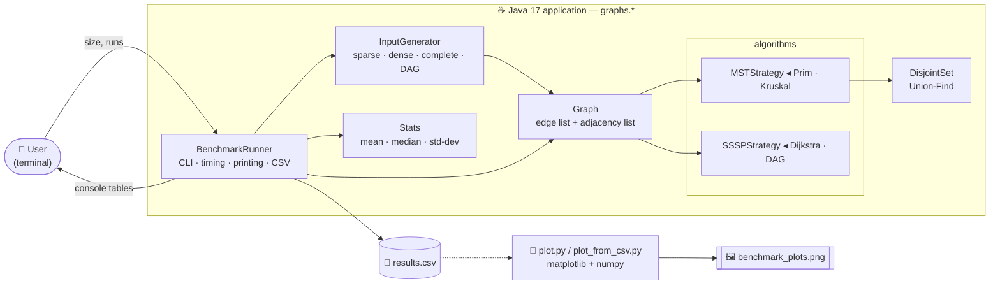

### Package layering

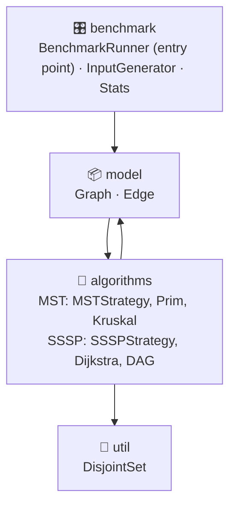

> ℹ️ `model` and `algorithms` reference each other: `Graph` constructs the concrete algorithm classes to dispatch calls, and the algorithms read the graph through `getV()`, `getEdges()` and `getAdjList()`. It is a small, deliberate coupling in a compact project — see [Limitations](#-known-limitations--roadmap) for how to break it.

### Runtime flow in one picture

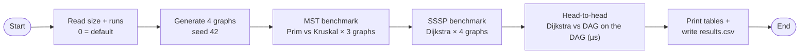

---

## 🧰 Tech Stack

### Core (Java)

| Technology | Version | Purpose |
|---|---|---|
| **Java** | 17 | Language / runtime (`maven.compiler.source/target = 17`; uses `Random.nextInt(origin, bound)` and `String.repeat`) |
| **Maven** | 3.8+ | Build, dependency management, packaging |
| **maven-assembly-plugin** | 3.4.2 | Builds `…-jar-with-dependencies.jar` with `Main-Class = graphs.benchmark.BenchmarkRunner` |
| **maven-surefire-plugin** | 3.1.2 | Runs JUnit 5 tests on `mvn test` |
| **JUnit Jupiter** | 5.10.0 | Unit testing (`test` scope) |
| **SLF4J API** | 2.0.9 | Logging facade (declared dependency) |
| **Logback Classic** | 1.4.11 | Logging backend; `logback.xml` sets root level `WARN` with a console appender |

### Java standard library used

| API | Where |
|---|---|
| `java.util.PriorityQueue` + `Comparator.comparingInt` | Prim, Dijkstra |
| `java.util.ArrayList` / `List` | Edge list, adjacency lists, results |
| `java.util.Stack` | Topological order in `DAG` |
| `java.util.Random` (seeded) | `InputGenerator` |
| `java.util.Scanner` | CLI input |
| `java.util.Arrays` (`copyOf`, `sort`) | `Stats.median` |
| `java.io.FileWriter` / `PrintWriter` | CSV output |
| `System.nanoTime()` | All timing |

### Visualisation (Python)

| Technology | Purpose |
|---|---|
| **Python 3.9+** | Plot scripts |
| **matplotlib** | Bar charts, log scale, error bars, annotations (`seaborn-v0_8-whitegrid` style in `plot.py`) |
| **numpy** | Bar-position arithmetic |

### Tooling

| Tool | Notes |
|---|---|
| **IntelliJ IDEA** | `.idea/` is committed (`misc.xml` → JDK 23 language level; the `pom.xml` still targets 17) |
| **Git** | Root `.gitignore` excludes `*.class`, `*.jar`, `*.zip`, logs; module `.gitignore` excludes `target/`, IDE folders |

---

## 📂 Repository & File Structure

```text
Graphs_Algorithms_Benchmarking-master/
├── README.md                                   ← this file
├── .gitignore                                  ignores *.class, *.jar, *.zip, *.log …
│
└── Graphs_ALgorithms_Benchmarking/             ☕ Maven module (note the capital "L" in the folder name)
    ├── pom.xml                                 Java 17 · JUnit 5 · SLF4J/Logback · assembly plugin
    ├── plot.py                                 🐍 3-panel matplotlib dashboard (values hard-coded)
    ├── results.csv                             📄 sample benchmark output (V = 5,000, 20 runs)
    ├── .gitignore                              target/, IDE files, OS files
    ├── .idea/                                  IntelliJ metadata
    │
    ├── docs/                                   (added with this README)
    │   ├── plot_from_csv.py                    🐍 renders the chart directly from results.csv
    │   └── benchmark_results.png               🖼️ chart embedded below
    │
    └── src/
        ├── main/
        │   ├── java/graphs/
        │   │   ├── model/
        │   │   │   ├── Edge.java               directed weighted edge  (u → v, weight)
        │   │   │   └── Graph.java              edge list + adjacency list + algorithm dispatch
        │   │   ├── algorithms/
        │   │   │   ├── MST/
        │   │   │   │   ├── MSTStrategy.java    interface: List<Edge> computeMST(Graph)
        │   │   │   │   ├── Prim.java           priority-queue greedy expansion
        │   │   │   │   └── Kruskal.java        sort edges + Union-Find
        │   │   │   └── SSSP/
        │   │   │       ├── SSSPStrategy.java   interface: int[] computeSSSP(Graph, int source)
        │   │   │       ├── Dijkstra.java       priority-queue relaxation
        │   │   │       └── DAG.java            DFS topological sort + single relaxation pass
        │   │   ├── util/
        │   │   │   └── DisjointSet.java        Union-Find (path compression, union by rank / size)
        │   │   └── benchmark/
        │   │       ├── BenchmarkRunner.java    🚀 main(): CLI, warm-up, timing, tables, CSV
        │   │       ├── InputGenerator.java     seeded random graph factory
        │   │       └── Stats.java              mean · median · standard deviation
        │   └── resources/
        │       └── logback.xml                 console appender, root level WARN
        └── test/java/graphs/
            └── GraphAlgorithmsTest.java        21 JUnit 5 tests
```

### File-by-file cheat sheet

| File | Lines | One-line role |
|---|---:|---|
| `BenchmarkRunner.java` | 211 | Entry point; orchestrates everything |
| `DAG.java` | 58 | Topological sort + shortest path, cycle detection |
| `DisjointSet.java` | 59 | Union-Find structure |
| `Graph.java` | 73 | Graph container + facade over the algorithms |
| `InputGenerator.java` | 90 | Builds the four test graphs |
| `Prim.java` | 47 | MST via heap |
| `Kruskal.java` | 29 | MST via sorted edges |
| `Dijkstra.java` | 34 | SSSP via heap |
| `Stats.java` | 41 | Statistics helpers |
| `Edge.java` | 12 | Edge value object |
| `MSTStrategy.java` / `SSSPStrategy.java` | 10 / 7 | Algorithm contracts |
| `GraphAlgorithmsTest.java` | 260 | Test suite |

---

## 🔬 Code Deep Dive

### `model` — the graph

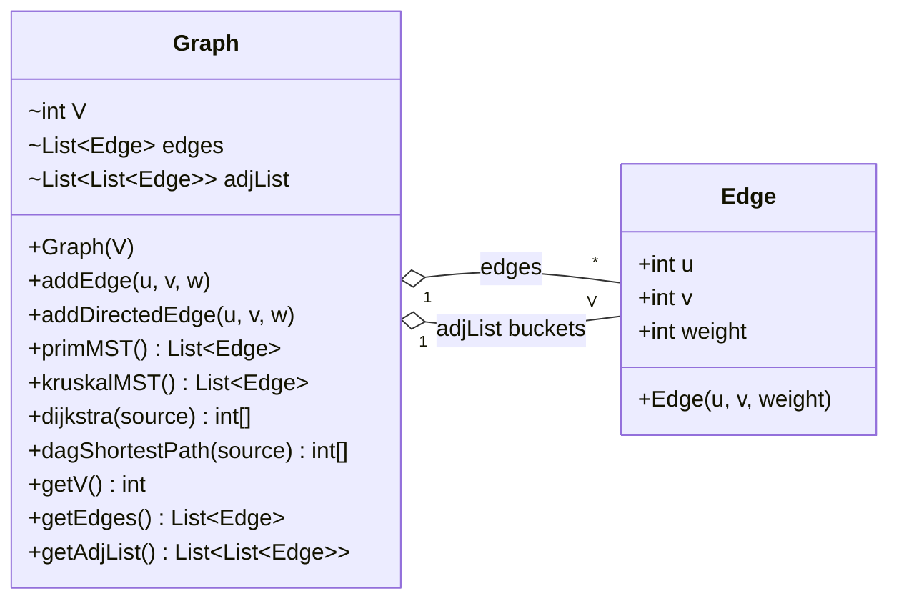

`Graph` keeps **two views of the same data**, so each algorithm can use the shape it needs:

| Field | Shape | Used by |
|---|---|---|
| `edges` | flat `List<Edge>` — **one entry per edge** | Kruskal (needs to sort all edges) |
| `adjList` | `List<List<Edge>>` — one bucket per vertex | Prim, Dijkstra, DAG (need neighbours of a vertex) |

How the two insert methods differ:

| Method | `edges` | `adjList` | Meaning |
|---|---|---|---|
| `addEdge(u, v, w)` | adds **1** `Edge(u→v)` | adds `Edge(u→v)` to `adj[u]` **and** a mirror `Edge(v→u)` to `adj[v]` | **Undirected** edge |
| `addDirectedEdge(u, v, w)` | adds 1 `Edge(u→v)` | adds it to `adj[u]` only | **Directed** edge (used for DAGs) |

The four methods `primMST()`, `kruskalMST()`, `dijkstra(s)` and `dagShortestPath(s)` are one-line wrappers: create the algorithm object, call `computeMST` / `computeSSSP(this, …)`.

### `algorithms` — Strategy interfaces

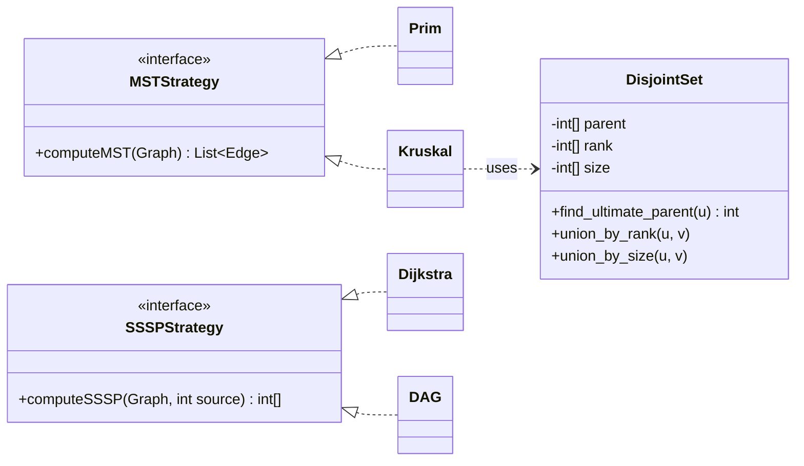

* MST algorithms return the chosen edges as a `List<Edge>` (an MST of a connected graph with V vertices has **V − 1** edges).
* SSSP algorithms return `int[] dist`, where `Integer.MAX_VALUE` means *unreachable*.

### `util` — `DisjointSet` (Union-Find)

| Method | Technique | Complexity |
|---|---|---|
| `find_ultimate_parent(u)` | Recursive find **with path compression** (every node on the path is re-pointed at the root) | amortised ≈ O(α(V)) |
| `union_by_rank(u, v)` | Attach the shallower tree under the deeper one; bump rank only on ties | amortised ≈ O(α(V)) |
| `union_by_size(u, v)` | Attach the smaller component under the larger one and add sizes | amortised ≈ O(α(V)) |

Kruskal uses `union_by_rank`; `union_by_size` is a ready-made alternative that no algorithm currently calls.

### `benchmark` — the harness

| Class | Responsibility |
|---|---|
| `BenchmarkRunner` | Prompts for size/runs, builds graphs, runs the measurement helpers, prints tables, appends rows to `results.csv` |
| `InputGenerator` | Static factory: `generateSparseGraph()`, `generateDenseGraph()`, `generateCompleteGraph()`, `generateDAG()`; `setV(int)` sets the vertex count |
| `Stats` | `mean(long[])`, `median(long[])` (copies + sorts, averages the two middle values for even length), `standardDeviation(long[])` (population formula, divides by *n*) |

Measurement helpers in `BenchmarkRunner`:

| Helper | Unit | Used for |
|---|---|---|
| `measurePrim`, `measureKruskal`, `measureDijkstra` | **ms** (`nanoTime / 1_000_000`) | MST section, SSSP section |
| `measureDijkstraMicro`, `measureDAGMicro` | **µs** (`nanoTime / 1_000`) | Dijkstra vs DAG head-to-head — the algorithms are fast enough that ms would round to 0 |

---

## 🧬 Graph Topologies & Input Generation

| Topology | Directed? | Edge count (formula) | Edges at **V = 5,000** | Shape |
|---|---|---|---:|---|
| **Sparse** | No | `5·V` | **25,000** | random spanning tree + random extra edges |
| **Dense** | No | `⌊0.25 · V(V−1)/2⌋` | **3,124,375** | random spanning tree + many random extra edges |
| **Complete** | No | `V(V−1)/2` | **12,497,500** | every pair connected exactly once |
| **DAG** | Yes | `5·V` | **25,000** | random tree with edges only from lower → higher index + random forward edges |

All weights are random integers in **[1, 1000]**.

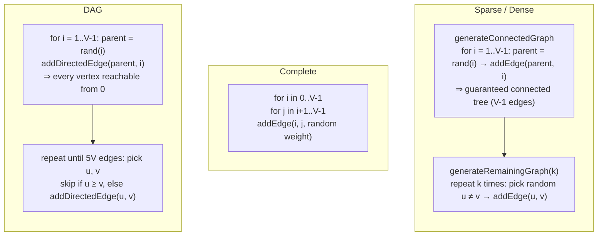

**Why these choices matter**

* **Connected by construction** — the “parent < child” tree guarantees a spanning tree exists, so Prim/Kruskal always return exactly V − 1 edges and Dijkstra from vertex `0` reaches every vertex.
* **Acyclic by construction** — in the DAG every edge goes from a smaller index to a larger one, so no cycle can ever form (and index order is itself a valid topological order).
* **Reproducible** — each generator creates its own `new Random(42)`.
* **Multigraph** — random extra edges are sampled *with replacement*, so parallel edges can occur. Both MST algorithms handle this correctly (covered by the `primAndKruskal_parallelEdges` test).

> 💾 **Memory heads-up (estimate, not measured):** at V = 5,000 the complete graph alone holds ~12.5 M undirected edges ⇒ ~25 M `Edge` objects, and the dense graph another ~6 M. Together with list overhead that is on the order of **1 GB** of heap. If you hit `OutOfMemoryError`, run with e.g. `java -Xmx4g -jar …`.

---

## 🧮 The Algorithms, Step by Step

### 1. Prim's MST — `algorithms/MST/Prim.java`

*Grow one tree from vertex 0, always adding the cheapest edge that leaves the tree.*

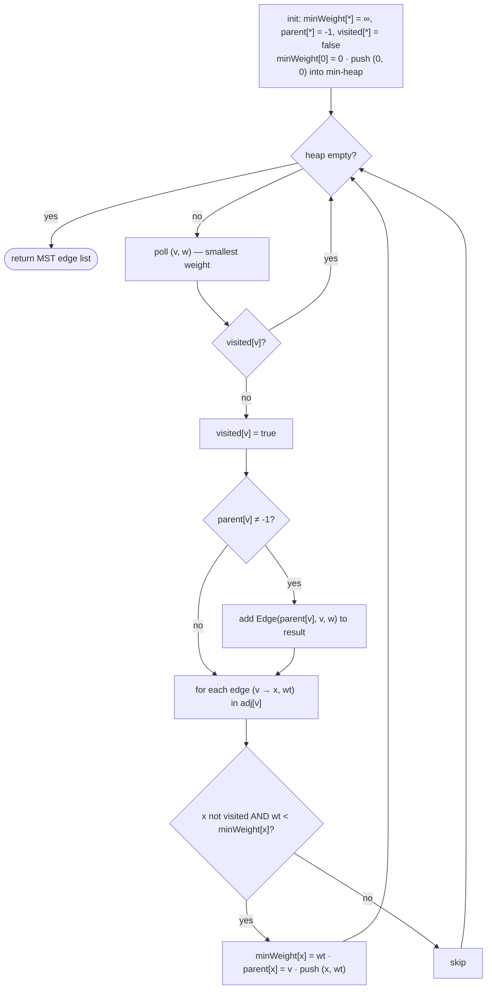

* **Lazy deletion:** instead of a decrease-key operation, a better entry is pushed and stale ones are skipped when polled (`if (visited[v]) continue`).
* **Complexity:** `O(E log E) = O(E log V)` with a binary heap. Space `O(V + E)`.
* **Disconnected graphs:** only the component containing vertex 0 is spanned (a forest is not built).

### 2. Kruskal's MST — `algorithms/MST/Kruskal.java`

*Sort all edges by weight; take an edge if it connects two different components.*

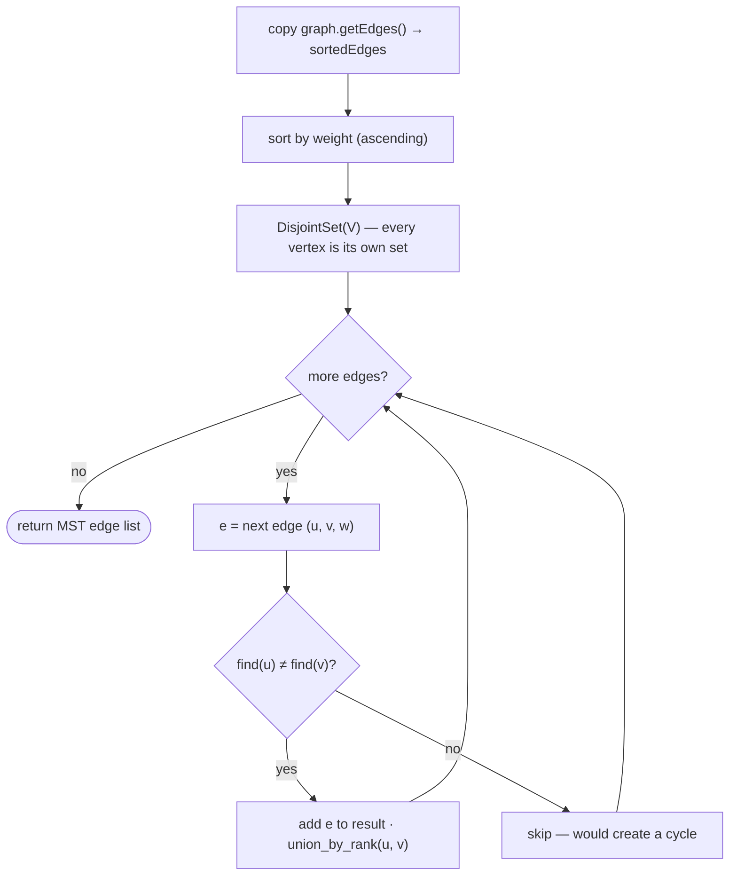

* **Complexity:** `O(E log E)` for the sort (dominates) + `O(E · α(V))` for Union-Find ⇒ **`O(E log E)`**. Space `O(E)` for the sorted copy.
* **Disconnected graphs:** naturally yields a minimum spanning *forest*.
* Because it sorts *every* edge, its cost explodes on dense/complete graphs — exactly what the benchmark shows.

### 3. Dijkstra — `algorithms/SSSP/Dijkstra.java`

*Repeatedly settle the closest unsettled vertex and relax its outgoing edges. Requires non-negative weights.*

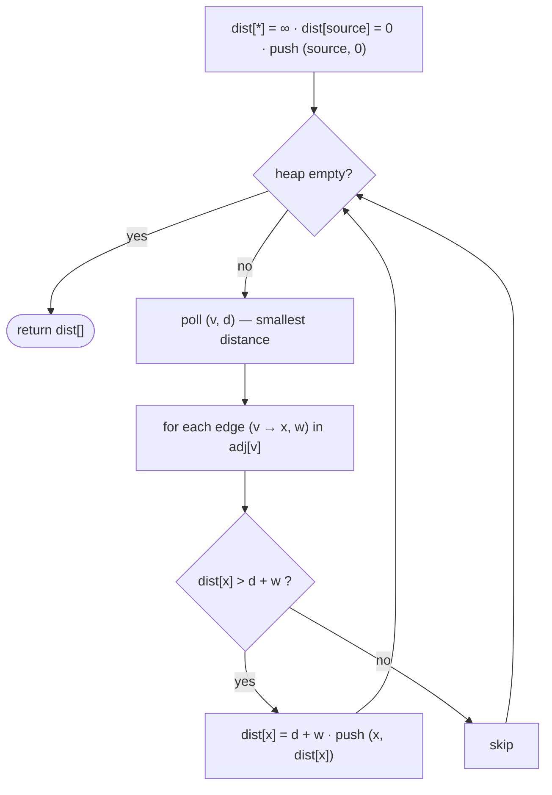

* **Complexity:** `O((V + E) log V)` with a binary heap.
* Uses the same lazy-deletion idea as Prim. Stale heap entries are tolerated (the `dist[x] > d + w` test prevents wrong updates) — see the optional improvement in the [Roadmap](#-known-limitations--roadmap).
* Works on **both** undirected and directed graphs because it only walks `adjList`.

### 4. DAG Shortest Path — `algorithms/SSSP/DAG.java`

*Order the vertices topologically, then relax each vertex's edges exactly once, in that order.*

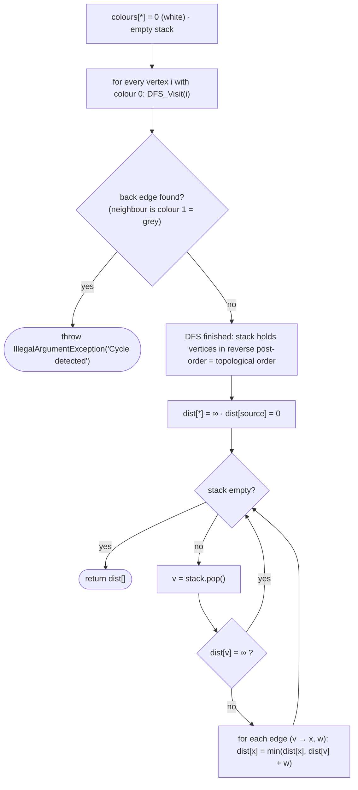

3-colour DFS (`DFS_Visit`):

| Colour | Meaning |
|---|---|
| `0` white | not visited |
| `1` grey | on the current DFS path — meeting a grey node means a **cycle** |
| `2` black | fully processed → pushed onto the stack |

* **Complexity:** `O(V + E)` — no heap, no log factor. Space `O(V)`.
* The timing includes the topological sort every call, so the comparison with Dijkstra is fair.
* Negative weights would also work for a DAG (not exercised here).
* Passing an **undirected** graph (built with `addEdge`) raises *Cycle detected*, because each undirected edge is a 2-cycle.

### Complexity cheat-sheet

| Algorithm | Time | Space | Best on | Data structure |
|---|---|---|---|---|
| Prim | `O(E log V)` | `O(V + E)` | dense graphs | binary heap |
| Kruskal | `O(E log E)` | `O(E)` | sparse graphs | sort + Union-Find |
| Dijkstra | `O((V + E) log V)` | `O(V + E)` | any non-negative weights | binary heap |
| DAG shortest path | `O(V + E)` | `O(V)` | DAGs only | DFS + stack |

---

## ⚙️ Benchmark Pipeline

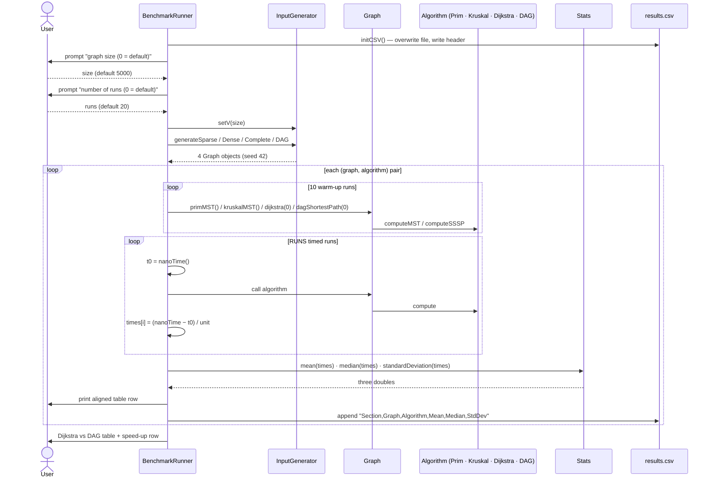

### Benchmark sections

| # | Section | Graphs | Algorithms | Unit | CSV `Section` tag |
|---|---|---|---|---|---|
| 1 | MST — Prim vs Kruskal | Sparse, Dense, Complete | Prim, Kruskal | ms | `MST` |
| 2 | SSSP — Dijkstra (source = 0) | Sparse, Dense, Complete, DAG | Dijkstra | ms | `SSSP` |
| 3 | SSSP — Dijkstra vs DAG | DAG | Dijkstra, DAG Shortest Path | µs | `DAG_SSSP` |

### Methodology

| Aspect | Choice | Why |
|---|---|---|
| **Warm-up** | 10 untimed runs per (graph, algorithm) | Lets the JIT compile hot loops before measuring |
| **Clock** | `System.nanoTime()` | Monotonic, high-resolution |
| **Runs** | 20 by default (user-configurable) | Enough for a stable mean/median |
| **Statistics** | mean · median · population std-dev | Median resists GC outliers; std-dev shows stability |
| **Inputs** | Fixed seed 42 | Identical graphs on every execution |
| **Source vertex** | Always `0` | Reaches every vertex in all four topologies |
| **Units** | ms for heavy work, µs for the Dijkstra/DAG race | Avoids rounding fast runs down to 0 |
| **Fairness** | Both competing algorithms run on the *same* `Graph` object | No input bias |

### Console output format

The runner prints aligned tables like this (values below are taken from the sample `results.csv`, shown to illustrate the layout):

```text
===========================================================================
  MST BENCHMARKS — Prim vs Kruskal
===========================================================================

  Graph: Dense
  Algorithm                    Mean (ms)    Median (ms)   Std Dev (ms)
  -------------------------------------------------------------------------
  Prim                             28.92          29.00           0.59
  Kruskal                         316.96         317.00           5.00
```

### CSV schema

```csv
Section,Graph,Algorithm,Mean,Median,StdDev
MST,Dense,Prim,28.92,29.00,0.59
MST,Dense,Kruskal,316.96,317.00,5.00
DAG_SSSP,DAG,DAG Shortest Path,537.96,540.00,66.13
```

---

## 📈 Results & Visualization

Sample run: **V = 5,000 · 20 runs · 10 warm-ups · seed 42** (from the committed `results.csv`).


### MST — Prim vs Kruskal (mean, ms)

| Graph | Prim | Kruskal | Prim is… |
|---|---:|---:|---|
| Sparse | 1.48 | 2.58 | **1.7×** faster |
| Dense | 28.92 | 316.96 | **11.0×** faster |
| Complete | 39.48 | 1,141.30 | **28.9×** faster |

### SSSP — Dijkstra across topologies (mean, ms)

| Graph | Mean | Median | Std Dev |
|---|---:|---:|---:|
| Sparse | 1.00 | 1.00 | 0.00 |
| Dense | 124.78 | 124.00 | 2.19 |
| Complete | 233.94 | 233.00 | 2.94 |
| DAG | 0.00 ¹ | 0.00 | 0.00 |

¹ The DAG run finishes in under a millisecond, so the integer-millisecond timer truncates it to 0. That is precisely why the head-to-head below is measured in **microseconds**.

### SSSP — Dijkstra vs DAG Shortest Path (DAG input, µs)

| Algorithm | Mean | Median | Std Dev |
|---|---:|---:|---:|
| Dijkstra | 760.52 | 749.50 | 31.10 |
| DAG Shortest Path | 537.96 | 540.00 | 66.13 |
| **Speed-up (Dijkstra ÷ DAG)** | **1.41×** | **1.39×** | — |

### What the numbers tell us

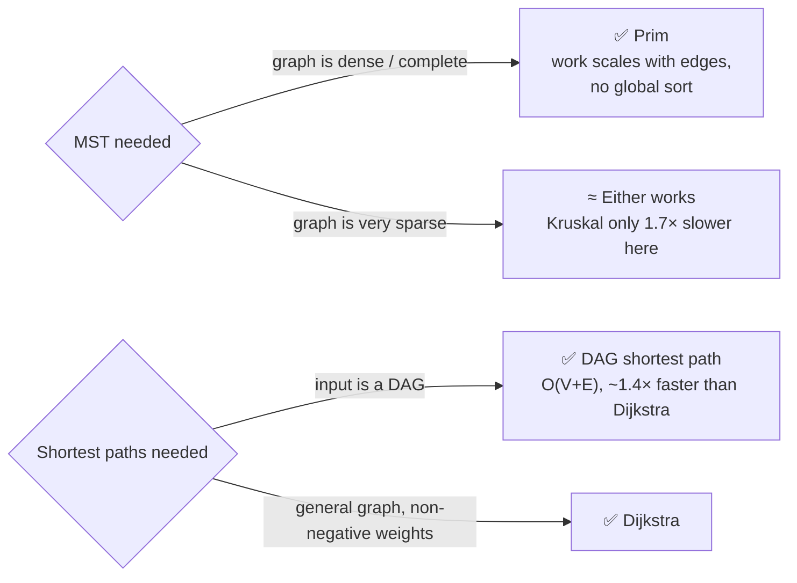

* **Prim wins and the gap widens with density** — Kruskal must sort all E edges (≈12.5 M on the complete graph), while Prim only touches each adjacency entry once.
* **Kruskal has the larger variance** on the sparse graph (std-dev 2.97 ms on a 2.58 ms mean) — at ~1–2 ms the measurement is dominated by timer granularity and GC noise, so treat the sparse numbers as indicative, not exact.
* **Dijkstra scales with edge count**: 1 ms → 125 ms → 234 ms as the graph goes sparse → dense → complete.
* **Removing the log factor pays off** — the DAG algorithm is ~1.4× faster on the same input. Its higher std-dev (66 µs vs 31 µs) shows more run-to-run jitter, likely from recursion and stack allocation in the DFS (an interpretation, not something the project measures).

### Plot scripts

| Script | Source of numbers | Output |
|---|---|---|
| `plot.py` | **Hard-coded** arrays from an earlier run (e.g. Prim/sparse = 2.35 ms), 3 panels | `benchmark_plots.png` |
| `docs/plot_from_csv.py` | Reads **your** `results.csv` | `docs/benchmark_results.png` |

---

## 🧩 Design Patterns

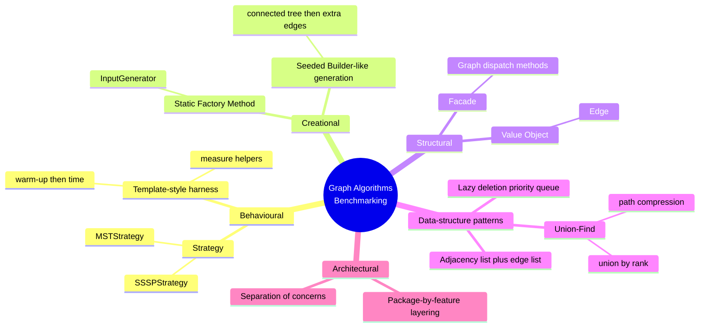

| # | Pattern | Where | Why it is used |
|---|---|---|---|
| 1 | **Strategy** | `MSTStrategy` ← `Prim`, `Kruskal`; `SSSPStrategy` ← `Dijkstra`, `DAG` | Interchangeable algorithms behind one contract — the whole point of a benchmark is to swap them on the same input |
| 2 | **Static Factory Method** | `InputGenerator.generateSparseGraph()` etc. | Hides how each topology is built; callers just ask for a graph type |
| 3 | **Facade** | `Graph.primMST()`, `kruskalMST()`, `dijkstra()`, `dagShortestPath()` | One-line, readable entry points that hide algorithm construction |
| 4 | **Value Object / DTO** | `Edge` | Plain carrier of `(u, v, weight)` shared by every algorithm |
| 5 | **Union-Find (Disjoint-Set)** | `DisjointSet` | Constant-ish-time cycle checks for Kruskal |
| 6 | **Lazy deletion** | `Prim`, `Dijkstra` | Avoids a decrease-key operation `PriorityQueue` doesn't offer |
| 7 | **Dual representation** | `Graph.edges` + `Graph.adjList` | Each algorithm gets the data layout that suits it |
| 8 | **Template-style measurement skeleton** | `measurePrim / measureKruskal / measureDijkstra / …` | Same “warm up → time N runs → return array” skeleton (implemented by copy rather than a shared abstraction) |
| 9 | **Separation of concerns** | `model` / `algorithms` / `util` / `benchmark` packages | Data, logic, helpers and measurement are independent |
| 10 | **3-colour DFS (white/grey/black)** | `DAG.DFS_Visit` | Classic cycle-detection state machine |

---

## 🏛️ OOP Principles & SOLID

### The four pillars

| Pillar | Evidence in the code |
|---|---|
| **Abstraction** | `MSTStrategy` and `SSSPStrategy` expose *what* is computed, not *how*; `Graph` hides edge/adjacency bookkeeping; `Stats` hides the maths; `InputGenerator` hides topology construction |
| **Polymorphism** | `Prim` and `Kruskal` are both `MSTStrategy`; `Dijkstra` and `DAG` are both `SSSPStrategy` — callers treat them uniformly through the interface type |
| **Encapsulation** | `DisjointSet` arrays and `DAG`'s DFS helpers are non-public; `InputGenerator`'s helpers are `private`; `Graph` fields are package-private behind getters. *(Partial: `Edge` fields are intentionally public for speed/simplicity.)* |
| **Inheritance** | Interface implementation: 2 + 2 algorithm classes implement their strategy interfaces. There is deliberately no deep class hierarchy |

### SOLID

| Principle | How it shows up | Honest caveat |
|---|---|---|
| **S** — Single Responsibility | `Edge` = data; `Stats` = statistics only; `DisjointSet` = Union-Find only; each algorithm class implements exactly one algorithm; `InputGenerator` = graph creation | `BenchmarkRunner` mixes CLI input, timing, console formatting and CSV writing |
| **O** — Open/Closed | A new algorithm = a new class implementing `MSTStrategy` / `SSSPStrategy`, no change to existing algorithms | `Graph` needs a new wrapper method, and `BenchmarkRunner` a new `measure…` helper, so the benchmark isn't fully closed to extension |
| **L** — Liskov Substitution | Any `MSTStrategy` returns a valid edge list; any `SSSPStrategy` returns a `dist[]` — implementations are drop-in replaceable | `DAG` throws on cyclic/undirected input and `Dijkstra` assumes non-negative weights, so each has stricter preconditions than the interface alone states |
| **I** — Interface Segregation | Both interfaces have exactly one method | — |
| **D** — Dependency Inversion | Interfaces exist and algorithms depend only on `Graph`'s public getters | `Graph` instantiates concrete `Prim`, `Kruskal`, `Dijkstra`, `DAG` with `new`, and `BenchmarkRunner` depends on the concrete `Graph`, so the abstraction isn't injected |

### Other principles in play

* **Reproducibility** — fixed seeds and deterministic generators.
* **Fail-fast** — `DAG` throws `IllegalArgumentException("Cycle detected")` rather than returning wrong distances.
* **Defensive copy** — Kruskal sorts a *copy* of `graph.getEdges()`, so the original list is never reordered.
* **Fair comparison** — competing algorithms share the same input object and the same warm-up/timing procedure.
* **Cross-validation** — Prim vs Kruskal and Dijkstra vs DAG are tested against each other.

---

## 📐 Data Structures & Algorithms Used

| Structure / technique | Where | Purpose |
|---|---|---|
| **Adjacency list** (`List<List<Edge>>`) | `Graph.adjList` | `O(deg)` neighbour iteration; `O(V + E)` space |
| **Edge list** (`List<Edge>`) | `Graph.edges` | Cheap global sort for Kruskal |
| **Binary min-heap** (`PriorityQueue<int[]>`) | Prim, Dijkstra | `O(log n)` extract-min; entries are `{vertex, key}` arrays compared on index 1 |
| **Disjoint-set forest** | `DisjointSet` | Cycle detection with path compression + union by rank/size |
| **Stack** (`java.util.Stack`) | `DAG` | Stores reverse post-order = topological order |
| **Boolean / int arrays** | `visited`, `minWeight`, `parent`, `dist`, `colours` | `O(1)` state lookups |
| **Comparison sort** (`List.sort`, `Arrays.sort`) | Kruskal edges, `Stats.median` | Timsort / dual-pivot quicksort, `O(n log n)` |
| **Depth-first search + 3-colouring** | `DAG.topo_sort` / `DFS_Visit` | Topological ordering and cycle detection |
| **Edge relaxation** | Dijkstra, DAG | Core shortest-path step: `dist[x] = min(dist[x], dist[v] + w)` |
| **Pseudo-random generation** (`Random(42)`) | `InputGenerator` | Reproducible weights and edges |
| **Random recursive tree** | `generateConnectedGraph`, `generateDAG` | Each vertex picks a random earlier parent ⇒ connected / acyclic skeleton |
| **Descriptive statistics** | `Stats` | Mean, median, population standard deviation |

---

## 🧪 Testing

```bash
cd Graphs_ALgorithms_Benchmarking
mvn test
```

**21 tests** in `GraphAlgorithmsTest` (JUnit 5, run by Surefire 3.1.2). The shared fixture is a 4-vertex square: edges `0-1 (1)`, `1-2 (2)`, `2-3 (3)`, `0-3 (4)` → MST weight **6**.

| Group | Tests | What they verify |
|---|---:|---|
| **Prim** | 4 | edge count = V − 1 · total weight = 6 · single vertex ⇒ empty MST · two vertices |
| **Kruskal** | 4 | same four checks as Prim |
| **MST agreement** | 1 | Prim and Kruskal produce the same total weight |
| **Dijkstra** | 4 | source 0 · source 1 · single vertex · linear chain `[0,1,2,3]` |
| **DAG shortest path** | 5 | simple DAG (`0→1→2→3 = 4`) · non-zero source with unreachable node · **cycle ⇒ `IllegalArgumentException`** · single vertex · agreement with Dijkstra |
| **Edge cases** | 3 | Dijkstra on a disconnected graph (`Integer.MAX_VALUE`) · parallel edges (picks the lighter) · DAG with an unreachable vertex |

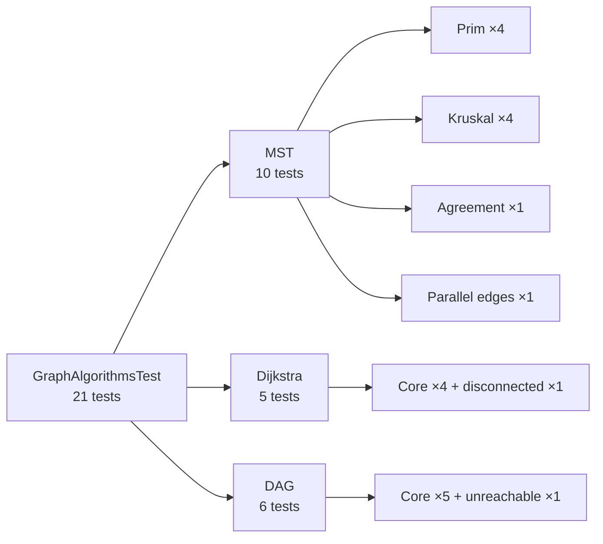

> The tests check small hand-verifiable graphs; the 5,000-vertex benchmark graphs are not asserted against a reference solution.

---

## 🚀 Getting Started

### Prerequisites

* **JDK 17+**
* **Maven 3.8+**
* **Python 3.9+** with `matplotlib` and `numpy` — only for plotting

### 1 · Build

```bash
cd Graphs_ALgorithms_Benchmarking
mvn package
```

Creates `target/Graph_Algorithms_Benchmarking-1.0-SNAPSHOT-jar-with-dependencies.jar` (the `maven-assembly-plugin` runs in the `package` phase).

### 2 · Run the benchmark

```bash
java -jar target/Graph_Algorithms_Benchmarking-1.0-SNAPSHOT-jar-with-dependencies.jar
```

You will be asked two questions:

```text
What is the size of input do you want to benchmark (Enter 0 for default size): 0
How many runs do you want for the benchmark (Enter 0 for default runs): 0
```

| Prompt | `0` means | Tip |
|---|---|---|
| Graph size (vertices) | **5,000** | Try `1000` for a quick run; sizes much above 5,000 make the complete graph very large (see the memory note above) |
| Number of runs | **20** | More runs ⇒ steadier statistics |

For large inputs: `java -Xmx4g -jar …`

`results.csv` is created/overwritten in the **current working directory**.

### 3 · Plot

```bash
pip install matplotlib numpy

# Option A — original dashboard (hard-coded sample values)
python plot.py                       # → benchmark_plots.png

# Option B — chart built from your fresh results.csv
python docs/plot_from_csv.py         # → docs/benchmark_results.png
```

### 4 · Run the tests

```bash
mvn test
```

### 5 · Use the algorithms as a library

```java
Graph g = new Graph(4);
g.addEdge(0, 1, 1);
g.addEdge(1, 2, 2);
g.addEdge(2, 3, 3);
g.addEdge(0, 3, 4);

List<Edge> mst   = g.primMST();        // or g.kruskalMST()  → 3 edges, total weight 6
int[]      dist  = g.dijkstra(0);      // [0, 1, 3, 4]

Graph dag = new Graph(3);
dag.addDirectedEdge(0, 1, 10);
dag.addDirectedEdge(1, 2, 5);
int[] d = dag.dagShortestPath(0);      // [0, 10, 15]
```

### Adding your own algorithm

```java
public class BellmanFord implements SSSPStrategy {
    @Override
    public int[] computeSSSP(Graph graph, int source) { /* ... */ }
}
```

Then add a one-line wrapper in `Graph`, a `measure…` helper in `BenchmarkRunner`, and a test in `GraphAlgorithmsTest`.

---

## ⚙️ Configuration

| Setting | Value | Location |
|---|---|---|
| Default vertex count | `5000` | `BenchmarkRunner.DEFAULT_SIZE` |
| Default timed runs | `20` | `BenchmarkRunner.DEFAULT_RUNS` |
| Warm-up runs | `10` | `BenchmarkRunner.WARM_UPS` |
| Output file | `results.csv` (working directory) | `BenchmarkRunner.CSV_FILE` |
| Random seed | `42` | `InputGenerator.seed` |
| Edge-weight range | `[1, 1000]` | `rand.nextInt(1, 1001)` in `InputGenerator` |
| Sparse edge budget | `5 · V` | `generateSparseGraph`, `generateDAG` |
| Dense edge budget | `25 %` of `V(V−1)/2` | `generateDenseGraph` |
| Source vertex | `0` | all `measure…` helpers |
| Java version | `17` | `pom.xml` |
| Log level | `WARN` (console) | `src/main/resources/logback.xml` |
| Main class | `graphs.benchmark.BenchmarkRunner` | `pom.xml` assembly manifest |

---

##  Roadmap
### Roadmap ideas

* 🔌 Inject strategies (`Graph.mst(MSTStrategy)` / `Graph.sssp(SSSPStrategy, source)`) and drive the benchmark from a list of strategies — removes the duplicated `measure…` helpers and the package cycle
* 🧰 Replace `Scanner` with CLI flags (`--size`, `--runs`, `--seed`, `--out`)
* ⏱️ Record everything in nanoseconds/microseconds and convert only when printing
* 📊 Make `plot.py` read `results.csv`; add a log-log “time vs V” scaling plot
* 🧪 Property-based tests: Prim weight == Kruskal weight and Dijkstra == DAG on random graphs; add tests for `Stats` and `InputGenerator`
* ➕ More algorithms: Bellman-Ford, Floyd-Warshall, A*, Borůvka, Fibonacci-heap Dijkstra
* 📏 JMH for statistically rigorous micro-benchmarks
* 🐳 CI (GitHub Actions) running `mvn test`, and a `Dockerfile` for a reproducible benchmark environment
* 🧹 Use SLF4J for run diagnostics, or drop the dependency

---

## 📄 License

MIT — as stated in the original project documentation. Add a `LICENSE` file at the repository root to make it official.

---

<div align="center">

**Graph Algorithms Benchmarking** — four classic algorithms, four graph shapes, one reproducible measurement harness.

</div>
